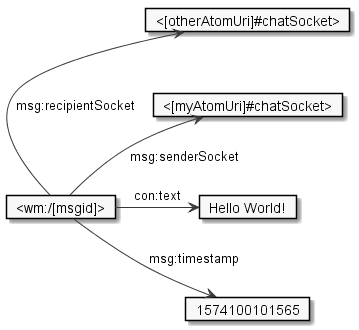
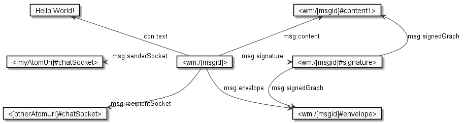
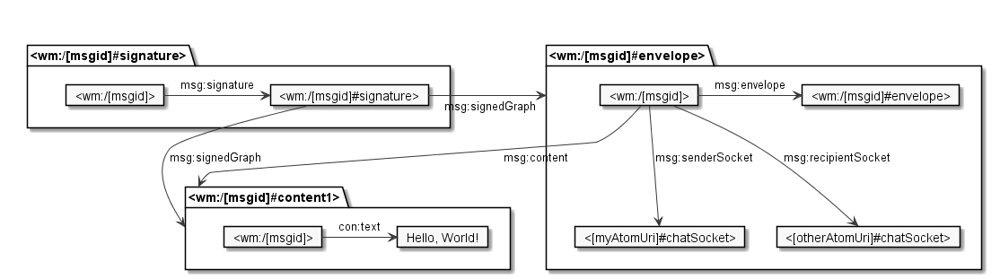

# WoN Messages

Messages are the main communcation medium in WoN. They are used to create and modify atoms, as well as to exchange information between diferent atoms.

Messages have the following properties
* A message is an RDF dataset.
* Each message has a URI of the form `wm:/[id] `, where `id` is a Base58 encoded multihash of its content.
* Each graph of the *message dataset* is a named graph (default graph is empty).
* All graph names are of the form `[message-uri]#[graphId]`, where [graphId] matches `[a-zA-Z0-9]+`
* Each message has an *envelope graph*, which is named `[message-uri]#envelope` 
* Each message has a *signature graph*, which is named `[message-uri]#signature`
* A message may have one or more *content graphs*, which can have any identifier except the two mentioned before.
* The envelope graph contains addressing and type information
* The signature graph contains a signature made with the public key of the atom or the WoN node that sent the message. 
* The content graphs may contain arbitrary data.
* Content graph and signature graph each contain a triple linking the graph to the message using `rdfg:subGraphOf`, i.e.
    `[message-uri]#envelope rdfg:subGraphOf [message-uri] .` and `[message-uri]#signature rdfg:subGraphOf [message-uri] .`. In the envelope graph, any content graphs are also linked to the message this way.
* The message dataset does not contain any other graphs, unless they are graphs belonging to other messages.

## Multiple Messages in one Dataset
The properties ensure that multiple messages can be aggregated in one dataset without affecting their interpretation. In a multi-message dataset, all named graphs that belong to a message can be identified by removing the fragment identifier (`#[graphId]`) from their graph URI. This yields the message URI.

## Structure Overview

The central RDF resource in a WoN message is the *message URI* of the form `wm:/[id] `. The message's data is linked to this resource, for example:



The information of a message, however, is separated in multiple RDF graphs. These graphs are named by URIs in the message dataset, which are discoverable from the message resource by following `msg:content`, `msg:envelope`, and `msg:signature`:



The same information, separated in graphs: 



## Envelope
The envelope contains type and addressing information. This information is given in the form of properties 
of the message URI, i.e, triples of the form [message-uri] [property] [value].

The following properties are used - however, not all properties are used in all message types. The definition of mandatory and optional properties per type can be found in [WonMessageType.java](webofneeds/won-core/src/main/java/won/protocol/message/WonMessageType.java)


| Property | Description |
| -------- | ----------- |
| `msg:messageType`| denotes the message type, for example, msg:CreateMessage |
| `msg:timestamp` | denotes the timestamp when the message was created |
| `msg:protocolVersion` | indicates the protocol version, currently `"1.0"`.
| `msg:content`| links to one of the message's content graphs |
| `msg:atom` | used in atom-specific messages (Create, Replace, Activate, Deactivate, Delete) as well as their Responses, to specify the atom |
| `msg:connection`  |  used in messages of type msg:SuccessResponse when acknowledging a message in an connection's message container |
| `msg:previousMessage`| links to an earlier message |
| `msg:senderSocket` | indicates the socket from which the message was sent |
| `msg:recipientSocket`| indicates the socket at which the message is addressed |
| `msg:respondingTo`| used in response messages to link to the message being responded to |
| `msg:respondingToMesageType`| used in response messages to indicate the type of message being responded to |


## Content
The content of a WoN message may contain arbitrary RDF triples, with only one exception: the message namespace (default prefix `msg:`)
may not be used. A common use case is sending text messages, in this case the `con:text` property from the
content namespace (default prefix `con:`) is used.

Example:
```
@prefix msg:   <https://w3id.org/won/message#> .
@prefix con:   <https://w3id.org/won/content#> .

# Envelope:
<wm:/[msgid]#envelope> {
    <wm:/[msgid]> msg:content <wm:/[msgid]#content-1> .
    <wm:/[msgid]#content-1> rdfg:subGraphOf <wm:/[msgid]> .
    # ... (other envelope triples omitted)
}

# Content graph: 
<wm:/[msgid]#content-1> {
    <wm:/[msgid]>
            con:text  "Nice, we are connected!" .
}
```

## Signature

The message signature is represented as RDF triples. The RDF resource denoting the signature is the same as the name of the graph it 
is contained in, i.e., `[message-uri]#signature`. A signature can sign one or more graphs. In most cases, a signature signs all graphs 
of a message. Messages of type CREATE_ATOM and REPLACE are special in that respect. For these messages, each content graph is
signed separately and the signatures are part of the content graph.

The follwing properties are used to specify a signature:

| Property | Description |
| --------- | -----------
| `msg:signer` |  links to the public key for its verification |
| `msg:signedGraph` | links to the graphs within the message that are signed by this signature |
| `msg:hash` | specifies the Base58-encoded multihash of the signed graphs |
| `msg:signatureValue` | specifies the Base64-encoded ECDSA signature value obtained signing the hash with the key |
| `msg:publicKeyFingerprint` | specifies the Base58-encoded multihash of the public key |


Example:
```
@prefix msg:   <https://w3id.org/won/message#> .
@prefix atom:  <https://localhost:8443/won/resource/atom/> .

<wm:/[msgid]#signature> {
    <wm:/[msgid]#signature>
            a                               msg:Signature ;
            msg:hasVerificationCertificate  atom:i573rg5eohhwqh77285g ;
            msg:signatureValue              "MGUCMDuZ8mDOEagNZBCH7aHvoNsFZVzgNmI7WFy2p2OpqolIOafDycNNmSuapUDpaxIOKwIxAO3beItRo4QYsA+4+6Iu7hPSJCnniQ0/9bkl27jS/W8oS8Q7iVwIiwxKq2/5XkuCaA==" ;
            msg:hash                        "W1p9hqRotr7VsYrvD4kWH1yE5RBLyyNNvPyu1BE6EFKpVh" ;
            msg:publicKeyFingerprint        "W1nQKZrBKwuo9MQbChv5tir2uZA2hHX5izrEiYH98v6nzC" ;
            msg:signedGraph                 <wm:/W1jfE1q9XN9EhKUTxKTAFwapuc6CyoJGYV5nEkhMfakMKS#envelope> .
    <wm:/[msgid]> msg:signature <wm:/[msgid]#signature> .
}

```

# Complete Example
Full example of a WoN message, in this case, a Create message:
```
<wm:/W1m1yyMqCaDLoWAKQPZYYaJRL7nctKoPVhyQ57c6WcSd3k#content-d7cj> {
    atom:yocee5mo10hvxn3uvimk
            a                  won:Atom ;
            dc:title           "Test Atom" ;
            cert:key           [ cert:PublicKey  [ a                  won:ECCPublicKey ;
                                                   won:ecc_algorithm  "EC" ;
                                                   won:ecc_curveId    "secp384r1" ;
                                                   won:ecc_qx         "711d26d7891f86300a382e5a7e0f32ad48e29f109526d9799d2fb89a490baff1e5a118366e94aa7134a3d3faaac3fd10" ;
                                                   won:ecc_qy         "f552821a439f5a4530e8524f5d6a2b3b069bf076155fd74270951c666a0b333d07f95f954310a5306378515fa8932b05"
                                                 ] ] ;
            won:defaultSocket  <https://localhost:8443/won/resource/atom/yocee5mo10hvxn3uvimk#chatSocket> ;
            won:socket         <https://localhost:8443/won/resource/atom/yocee5mo10hvxn3uvimk#chatSocket> , <https://localhost:8443/won/resource/atom/yocee5mo10hvxn3uvimk#socket1> , <https://localhost:8443/won/resource/atom/yocee5mo10hvxn3uvimk#holdableSocket> ;
            match:flag         match:UsedForTesting .
    
    <https://localhost:8443/won/resource/atom/yocee5mo10hvxn3uvimk#chatSocket>
            won:socketDefinition  <https://w3id.org/won/ext/chat#ChatSocket> .
    
    <https://localhost:8443/won/resource/atom/yocee5mo10hvxn3uvimk#socket1>
            won:socketDefinition  <https://w3id.org/won/ext/chat#ChatSocket> .
    
    <https://localhost:8443/won/resource/atom/yocee5mo10hvxn3uvimk#holdableSocket>
            won:socketDefinition  <https://w3id.org/won/ext/hold#HoldableSocket> .
}

<wm:/W1m1yyMqCaDLoWAKQPZYYaJRL7nctKoPVhyQ57c6WcSd3k#envelope> {
    <wm:/W1m1yyMqCaDLoWAKQPZYYaJRL7nctKoPVhyQ57c6WcSd3k>
            a                    msg:FromOwner ;
            msg:atom             atom:yocee5mo10hvxn3uvimk ;
            msg:content          <wm:/W1m1yyMqCaDLoWAKQPZYYaJRL7nctKoPVhyQ57c6WcSd3k#content-d7cj> ;
            msg:envelope         <wm:/W1m1yyMqCaDLoWAKQPZYYaJRL7nctKoPVhyQ57c6WcSd3k#envelope> ;
            msg:messageType      msg:CreateMessage ;
            msg:protocolVersion  "1.0" ;
            msg:timestamp        1574256374484 .
    
    <wm:/W1m1yyMqCaDLoWAKQPZYYaJRL7nctKoPVhyQ57c6WcSd3k#envelope>
            a                      msg:EnvelopeGraph ;
            msg:containsSignature  <wm:/W1m1yyMqCaDLoWAKQPZYYaJRL7nctKoPVhyQ57c6WcSd3k#content-d7cj-sig> .
    
    <wm:/W1m1yyMqCaDLoWAKQPZYYaJRL7nctKoPVhyQ57c6WcSd3k#content-d7cj-sig>
            a                         msg:Signature ;
            msg:hash                  "W1jBGZWLn8b3erQCoUqzykz5DzarNR6aQGzmhwtJZ7zobH" ;
            msg:publicKeyFingerprint  "W1fBnLmQHAbkNN3kEu5GNHazRhuNPpcBqGGfZk3JP2L7sF" ;
            msg:signatureValue        "MGYCMQDIpNhCOI/cVWGmBuQg4i8G0jGsnEs+hRVKHyy5alIAPDcbdWVe+UPmVMqkumMhsf8CMQCKiRJq0EUc8/Kc9D6mgxKrWLEcrDe9u4Ubmf+Arkdy/OljmJKG8FHrKNhIR/P/k5A=" ;
            msg:signedGraph           <wm:/W1m1yyMqCaDLoWAKQPZYYaJRL7nctKoPVhyQ57c6WcSd3k#content-d7cj> ;
            msg:signer                atom:yocee5mo10hvxn3uvimk .
}

<wm:/W1m1yyMqCaDLoWAKQPZYYaJRL7nctKoPVhyQ57c6WcSd3k#signature> {
    <wm:/W1m1yyMqCaDLoWAKQPZYYaJRL7nctKoPVhyQ57c6WcSd3k>
            msg:signature  <wm:/W1m1yyMqCaDLoWAKQPZYYaJRL7nctKoPVhyQ57c6WcSd3k#signature> .
    
    <wm:/W1m1yyMqCaDLoWAKQPZYYaJRL7nctKoPVhyQ57c6WcSd3k#signature>
            a                         msg:Signature ;
            msg:hash                  "W1bibbwCCZA4n6XQMtFzxhuDfFZ6gdcZjUx6NZ57jSFwKr" ;
            msg:publicKeyFingerprint  "W1fBnLmQHAbkNN3kEu5GNHazRhuNPpcBqGGfZk3JP2L7sF" ;
            msg:signatureValue        "MGUCMQDVT+wJuaCpMzVUZHhF0+DnSoMMuVzPTjcMbg6cmrLN40iCTR+OhvJ5tUa5vwo2z6sCMElebX+ny5kfuxamjrr9n3TqSrK83AnjqYUt5KA651sSLPNKDpUvV0OuQ8HG+HF4Ng==" ;
            msg:signedGraph           <wm:/W1m1yyMqCaDLoWAKQPZYYaJRL7nctKoPVhyQ57c6WcSd3k#envelope> ;
            msg:signer                atom:yocee5mo10hvxn3uvimk .
}
```


