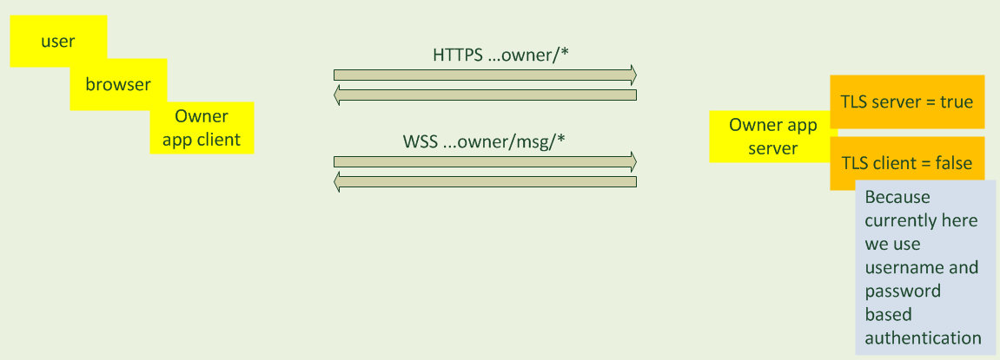
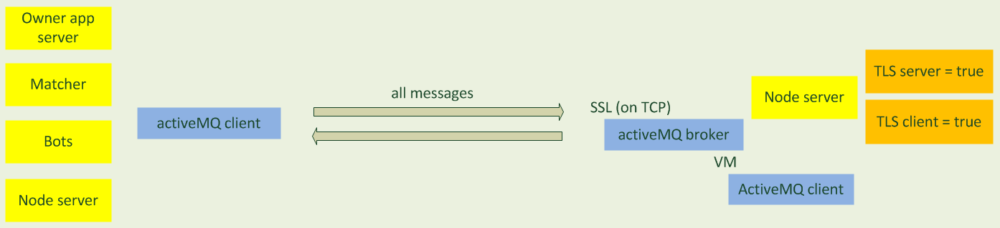
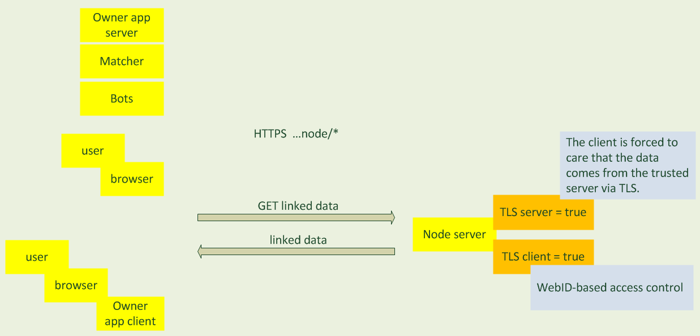

##Data channels

In the current implementation, the communication channels on which sensitive user data can be transmitted are: 
  * [user browser and Owner application server](#user-browser-and-owner-application-server-channel);
  * [messaging client and Node application server](#owner-node-matcher-node-node-node-applications-channel):
   * Owner application server and Node application server,
   * Node application server and another Node application server, 
   * Matcher application and Node application server;
  * [any linked data client and Node application server](#node-application-channel-for-reading-linked-data). 
  
On all those channels we apply TLS protocol, to ensure endpoints authentication and data encryption to 
protect it from eavesdropping by the unauthorized parties. 

###User browser and Owner application server channel

This is a channel directly facing the user when creating and managing his Atoms, establishing and conducting 
communication with other Atoms. The user uses the browser, where the Owner application client side creates HTTP and 
Web Socket (WS) channels for the data transfer. The Owner application specific data is transferred via HTTP channel, 
while WoN messaging data is transferred via WS channel.
  
The channels are implemented as HTTPS (HTTP+TLS) and WSS (Web Socket Secure - WS+TLS) with server 
TLS authentication and without client TLS authentication. In that way server must be authenticated, while the user 
not - the Owner application authenticates the user in  different from TLS protocol way, namely, via password (other 
solutions present a GUI and key management challenge). The Owner server is authenticated so that the user can be sure it
is speaking to the expected Owner server, and that his data is encrypted during transfer and cannot be read by other 
parties. The client is authenticated via password, so that she can only see its own data and not the other users.
Own data of the user includes the certificates of Atom generated by that user, including their private keys.

The application of TLS (HTTPS and WSS) on this channel is triggered by the 
owner's server and application configuration described in [Authentication](authentication.md) section (see Tomcat 
and Application configurations). The user authentication is managed by Spring security, see 
[corresponding configuration](../../won-owner-webapp/src/main/resources/spring/owner-security.xml) for more detail.

For development purposes, Owner application server has self-signed certificate. For production, a certificate signed 
by a trusted CA should be used, otherwise users cannot be sure they communicate with the announced server.
 
###Owner-Node, Matcher-Node, Node-Node applications channel

 
The channel between Owner application server and Node server, Matcher and Node server, as well 
as between two Node servers, is a TLS protected JMS channel (using activeMQ implementation) with required server and 
client TLS authentication. This is the channel, on which the data transfer happens during the 
[message exchange](message-signatures.md). 

The application of TLS on this channel is triggered by the broker configuration on Node described in 
[Authentication](authentication.md) section (see JMS configurations).

Here, the endpoints are authenticated by self-signed certificates and rely on 
TLS+[TOFU trust](../src/main/java/won/cryptography/ssl/TOFUStrategy.java) 
, i.e. the clients and servers trust each other on the first use, 
remember each other certificates, and for the next communications require that the certificate is the same, otherwise
the party is not authenticated and the connection fails. It is possible to switch, though, to using the Public Key 
Infrastructure (PKI), when communication channel endpoints trust each other based on issued by trusted Certificate 
Authority (CA) certificates instead of applying TOFU trust. Since integration with available PKI implies buying 
certificates from a CA, this solution was not possible for reference implementation. Another solution considered but 
not implemented for authenticating endpoints on the communication channels listed above is based on WebID+TLS 
verification. It is also possible to switch to it in the current design, provided all communication channel endpoints
have a WebID with their public key published. 
 
###Node application channel for reading linked data

This is a channel on which the linked data is transferred from Node web application to any client that wants to read 
this data. The client reads data via HTTP GET requests to the data URIs. These include Atoms and Nodes resource 
descriptions and their messages. See more details in [won-node-webapp](../../won-node-webapp) module.
  
The channel is implemented as HTTPS channel with required server and client authentication. 
The server is authenticated so that the linked data client can be sure it can trust the returned data is really 
published on that server and is not modified or viewed by an unauthorized party. The client is authenticated because 
of possible [access restrictions](access-control.md) to linked data. 

The application of TLS (HTTP + TLS = HTTPS) on this channel is triggered by the 
node's server and application configuration described in [Authentication](authentication.md) section (see Tomcat 
and application configurations) and, for certain data, applying the WebID filter described in 
[Access control](access-control.md) section.
 
 
 