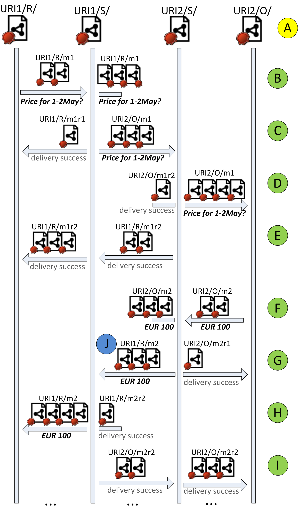

## WoN Message Signatures and their usage


All the messages in WoN are issued by Node, Atom, or Matcher. The messages issued by Atom and Node are signed by them.
 It is planned that messages from Matcher are also signed, as soon as we expose the Matcher's 
 [web identity](web-identity.md) in the way we do for Node and Atom.
  
The receiving or viewing party processes the WoN message (or data that is part of the message) only if it is 
well-formed and verifies against the expected signers. The node always publishes the messages it receives or 
sends, together with their signatures - as a result the signed data of messages become part of linked data. Such 
approach provides authentication, non-repudiation, protection from unauthorized modification, communication 
traceability and availability in WoN.


### RDF representation

We represent the signature as a named graph. The graph name corresponds the the unique signature name. The content of
the graph - signature resource description - describes the algorithm used for normalization, hashing 
and signing. Knowing those, the signed data can be verified by applying the same algorithms during 
verification. 
The reference to the signer is included in the signature. De-referencing the signer URI should result in signer's 
resource description containing his public key description, according to WoN [web identity](web-identity.md). The 
signature graph also contains the reference to the name of the graph that this signature signs. The content of this 
graph has to be verified using the signature value, the public key of the signer and algorithms specified in signature.

Below is an example of the signature graph referencing another graph that it signs (the referenced graph is not shown).

```
@prefix msg:   <https://w3id.org/won/message#> .
@prefix signature: <http://icp.it-risk.iwvi.uni-koblenz.de/ontologies/signature.owl#> .
@prefix xsd:   <http://www.w3.org/2001/XMLSchema#> .
@prefix cert:  <http://www.w3.org/ns/auth/cert#> .
@prefix rdfs:  <http://www.w3.org/2000/01/rdf-schema#> .
@prefix rdf:   <http://www.w3.org/1999/02/22-rdf-syntax-ns#> .

<https://localhost:8889/won/resource/event/n8s7pk2y0nxdyg20s0rc#envelope-cw1d-sig> {
    <https://localhost:8889/won/resource/event/n8s7pk2y0nxdyg20s0rc#envelope-cw1d-sig>
            a                            signature:Signature ;
            signature:hasGraphSigningMethod
                    [ a                               signature:GraphSigningMethod ;
                      signature:hasDigestMethod       signature:dm-sha-256 ;
                      signature:graphCanonicalizationMethod
                              signature:gcm-fisteus-2010 ;
                      signature:graphDigestMethod  signature:gdm-fisteus-2010 ;
                      signature:graphSerializationMethod
                              signature:gsm-trig ;
                      signature:hasSignatureMethod    signature:sm-ecdsa
                    ] ;
            signature:signatureValue  "MGUCMAfOwjpbp8F+YCDhYAfEzHYdjlBG+qvvLzZGusoxr31xjm8BlKVR230M2PS4s8tylwIxAMgCWkHPZTvy5bCVd6+3WNikkCSeCNNR/Jck+LPYU8vCfughKrXTaTrAWOTnX0e9hw==" ;
            signature:hasVerificationCertificate <https://localhost:8889/won/resource> ;
            msg:signedGraph   <https://localhost:8889/won/resource/event/n8s7pk2y0nxdyg20s0rc#envelope-cw1d> .
}
```


We use vocabulary from 
[Signingframework library](https://github.com/akasten/signingframework/blob/master/ontologies/signature.owl) for 
representing the signature, and additionally have defined our own property **msg:signedGraph** to be able to 
reference the signed named graph.

Assigning a URI to a signature makes it possible to reference signatures, both from the same message and from other documents. 
Referencing the signatures is necessary in order to enable iterative signing by chaining the signatures in the same 
way we chain the content and envelopes when composing the message. 


### Signature chaining
Signatures are chained in a message in parallel to the message envelopes chaining. Generally, a WoN message is 
composed in a chained manner: existing envelopes and payload graphs are referenced from the newly added envelopes, 
including reference to the signatures of those graphs. Signatures are referenced by **msg:containsSignature** 
relation. The outermost envelope graph is the one that must be verified first by the recipient to 
determine how to process the message further, working 'inward' from there. An example below contains two envelopes 
and two signatures:


```
@prefix msg:   <https://w3id.org/won/message#> .
@prefix conn:  <https://localhost8889/won/resource/connection/> .
@prefix signature: <http://icp.it-risk.iwvi.uni-koblenz.de/ontologies/signature.owl#> .
@prefix woncrypt: <https://w3id.org/won/core#> .
@prefix atom:  <https://localhost8889/won/resource/atom/> .
@prefix xsd:   <http://www.w3.org/2001/XMLSchema#> .
@prefix cert:  <http://www.w3.org/ns/auth/cert#> .
@prefix rdfs:  <http://www.w3.org/2000/01/rdf-schema#> .
@prefix geo:   <http://www.w3.org/2003/01/geo/wgs84_pos#> .
@prefix rdf:   <http://www.w3.org/1999/02/22-rdf-syntax-ns#> .
@prefix won:   <https://w3id.org/won/core#> .
@prefix ldp:   <http://www.w3.org/ns/ldp#> .
@prefix event: <https://localhost8889/won/resource/event/> .
@prefix sioc:  <http://rdfs.org/sioc/ns#> .
@prefix dc:    <http://purl.org/dc/elements/1.1/> .


<https://localhost8889/won/resource/event/n8s7pk2y0nxdyg20s0rc#envelope-cw1d> {
    <https://localhost8889/won/resource/event/n8s7pk2y0nxdyg20s0rc#envelope-cw1d>
            a       msg:EnvelopeGraph ;
            <http://www.w3.org/2004/03/trix/rdfg-1/subGraphOf>
                    event:n8s7pk2y0nxdyg20s0rc .
    
    event:n8s7pk2y0nxdyg20s0rc
            a                            msg:FromSystem ;
            msg:messageType           msg:SuccessResponse ;
            msg:recipient              <https://localhost:8889/won/resource/connection/tpnfpv7jllafv9of2keu> ;
            msg:recipientAtom          <https://localhost:8889/won/resource/atom/2522931766117794000> ;
            msg:recipientNode          <https://localhost:8889/won/resource> ;
            msg:sender                conn:itdt8y3re7fy161g0c4j ;
            msg:senderAtom            atom:qlk9kwp0l2i8o6m9a8dg ;
            msg:senderNode            <https://localhost8889/won/resource> ;
            msg:isRemoteResponseTo       <https://localhost:8889/won/resource/event/3803545276954706000> ;
            msg:isResponseTo             event:r0bna8i52znu7epammor ;
            msg:isResponseToMessageType  msg:OpenMessage .
}

<https://localhost8889/won/resource/event/n8s7pk2y0nxdyg20s0rc#envelope-cw1d-sig> {
    <https://localhost8889/won/resource/event/n8s7pk2y0nxdyg20s0rc#envelope-cw1d-sig>
            a                            signature:Signature ;
            signature:hasGraphSigningMethod
                    [ a                               signature:GraphSigningMethod ;
                      signature:hasDigestMethod       signature:dm-sha-256 ;
                      signature:graphCanonicalizationMethod
                              signature:gcm-fisteus-2010 ;
                      signature:graphDigestMethod  signature:gdm-fisteus-2010 ;
                      signature:graphSerializationMethod
                              signature:gsm-trig ;
                      signature:hasSignatureMethod    signature:sm-ecdsa
                    ] ;
            signature:signatureValue  "MGUCMAfOwjpbp8F+YCDhYAfEzHYdjlBG+qvvLzZGusoxr31xjm8BlKVR230M2PS4s8tylwIxAMgCWkHPZTvy5bCVd6+3WNikkCSeCNNR/Jck+LPYU8vCfughKrXTaTrAWOTnX0e9hw==" ;
            signature:hasVerificationCertificate
                    <https://localhost8889/won/resource> ;
            msg:signedGraph           <https://localhost8889/won/resource/event/n8s7pk2y0nxdyg20s0rc#envelope-cw1d> .
}

<https://localhost8889/won/resource/event/n8s7pk2y0nxdyg20s0rc#envelope-05af> {
    <https://localhost8889/won/resource/event/n8s7pk2y0nxdyg20s0rc#envelope-05af>
            a                     msg:EnvelopeGraph ;
            msg:containsEnvelope  <https://localhost8889/won/resource/event/n8s7pk2y0nxdyg20s0rc#envelope-cw1d> ;
            <http://www.w3.org/2004/03/trix/rdfg-1/subGraphOf>
                    event:n8s7pk2y0nxdyg20s0rc .
    
    event:n8s7pk2y0nxdyg20s0rc
            a                         msg:FromSystem ;
            msg:receivedTimestamp  "1458127303119"^^xsd:long ;
            msg:containsSignature   [ msg:signatureGraph  <https://localhost8889/won/resource/event/n8s7pk2y0nxdyg20s0rc#envelope-cw1d-sig> ;
                                        msg:signatureValue  "MGUCMAfOwjpbp8F+YCDhYAfEzHYdjlBG+qvvLzZGusoxr31xjm8BlKVR230M2PS4s8tylwIxAMgCWkHPZTvy5bCVd6+3WNikkCSeCNNR/Jck+LPYU8vCfughKrXTaTrAWOTnX0e9hw==" ;
                                        msg:signedGraph     <https://localhost8889/won/resource/event/n8s7pk2y0nxdyg20s0rc#envelope-cw1d>
                                      ] .
}

<https://localhost8889/won/resource/event/n8s7pk2y0nxdyg20s0rc#envelope-05af-sig> {
    <https://localhost8889/won/resource/event/n8s7pk2y0nxdyg20s0rc#envelope-05af-sig>
            a                            signature:Signature ;
            signature:hasGraphSigningMethod
                    [ a                               signature:GraphSigningMethod ;
                      signature:hasDigestMethod       signature:dm-sha-256 ;
                      signature:graphCanonicalizationMethod
                              signature:gcm-fisteus-2010 ;
                      signature:graphDigestMethod  signature:gdm-fisteus-2010 ;
                      signature:graphSerializationMethod
                              signature:gsm-trig ;
                      signature:hasSignatureMethod    signature:sm-ecdsa
                    ] ;
            signature:signatureValue  "MGUCMC2hvYxP4EKcj7lQBKyC8v4hen3Dokkt+wJYa146TfSfMpEvjeoVVpDkh66qp9EVwQIxAPrAKN0XT1kMuJOnOcuPbbrgyDPiN6okFhiEUdlUQugzgyD+7q6An7Yjg+qFHUpTYQ==" ;
            signature:hasVerificationCertificate
                    <https://localhost8889/won/resource> ;
            msg:signedGraph           <https://localhost8889/won/resource/event/n8s7pk2y0nxdyg20s0rc#envelope-05af> .
}

```

The outer envelope is represented by the named graph 
```<../event/n8s7pk2y0nxdyg20s0rc#envelope-05af>```. It references another envelope as well
as its signature. Verification of this message proceeds in a chained manner: 
 * verification of the outer envelope ```<.../event/n8s7pk2y0nxdyg20s0rc#envelope-05af>```
signed by the signature ```<.../event/n8s7pk2y0nxdyg20s0rc#envelope-05af-sig>```
 * verification of the referenced envelope ```<.../event/n8s7pk2y0nxdyg20s0rc#envelope-cw1d>``` 
signed by the signature ```<.../event/n8s7pk2y0nxdyg20s0rc#envelope-cw1d-sig>```
 * equality check of the referenced signature value in the signature graph and in the referencing envelope
   


### Signing and Verification Implementation

We use [Signingframework library](https://github.com/akasten/signingframework/blob/master/ontologies/signature.owl) 
for signing or verifying RDF graphs, applying the algorithm developed by 
[Fisteus et al.](http://dl.acm.org/citation.cfm?id=1809692) due to its minimum 
signature overhead in comparison to other algorithms, as suggested by 
[Kasten et al.](http://2014.eswc-conferences.org/sites/default/files/papers/paper_80.pdf). 
Elliptic Curve Digital Signature Algorithm (ECDSA) with 384-Bit curves is used as the signature generation and verification algorithm. 
However, our approach is not dependent on a particular algorithm; a support for any algorithm for RDF 
normalization and signing may be added. 

The details of the signing and verification process can be found by inspecting 
[SignatureAddingWonMessageProcessor](../../won-cryptography/src/main/java/won/protocol/message/processor/impl/SignatureAddingWonMessageProcessor.java)
and 
[SignatureCheckingingWonMessageProcessor](../../won-cryptography/src/main/java/won/protocol/message/processor/impl/SignatureCheckingWonMessageProcessor.java)
. These processors are applied by WoN communicating entities during message exchange.


### Usage in message exchange protocol

The signatures are used in message exchange protocol to establish the authenticity of the data and its right to be 
added to the conversation. For example, at Node, 
[WonMessageRoutes](../../won-node/src/main/java/won/node/camel/route/fixed/WonMessageRoutes.java) defines for each 
protocol the exact processing steps of the incoming and outgoing messages. The processors include signature 
verification, message wellformedness checks, signature adding.

The example fragment of the communication between WoN communicating entities is represented below.
URI1/R/ represents that atom published at server URI1, the URI1 server's publishing service is represented by URI1/S/. 
Another atom is represented by URI2/O/ with its publishing service URI2/S/. These are four participants in our 
example conversation, marked by A. These participants have their certificates and make their public key available 
under their resource URIs.




*  steps marked by **B**:
  * The atom URI1/R/ sends a message to the atom URI2/O/ asking about the price. the message URI is URL1/R/m1. This 
message is first received by the publishing service URI1/S/. The service verifies the message and the signatures, it 
can also add its own data to the message, such as received time. It signs the added data and publishes the message. 

* steps marked by **C**:
 * Success response message URL1/R/m1r1 is created, signed, published,
and sent back to the URL1/R/. Next, the service sends the message URL1/R/m1 on to recipient publishing service: it 
generates a new URI for the message, URL2/O/m12 (the one under which it can be published by recipient publishing 
service). It then adds new metadata to the message, such as reference to the original message, sent time, etc. Next,
it signs the added metadata, and sends it to URI2/S/.

* steps marked by **D**:
 * The recipient publishing service successfully receives the message and, after adding metadata and signing the 
message, publishes it. Finally it is sent to its destination, URL2/O/. 

* steps marked by **E**:
 * The recipient’s publishing 
service also issues, signs and sends a success response message for the original sender, URL1/R/m1r2, which, in 
turn, is received, published and directed to URL1/R/ by its publishing service URL1/S/. 

At some point the owner of the atom reads the message and sends an answer message back, telling the price. The 
resulted messages and their transportation are marked by F, G, H and I . If the conversation continues, the following
messages generated between the atoms are processed and transported in a similar way. 


 
 

